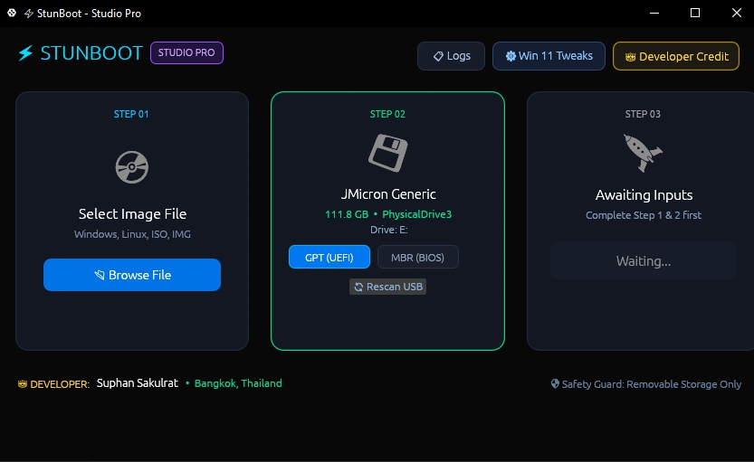

# StunBoot

Free, portable, high-performance bootable USB creator for Windows 11/10 and Linux. Direct 2MB aligned block streaming, automatic UEFI/BIOS setup, and built-in Windows 11 TPM 2.0 & Secure Boot bypass. 100% free, standalone single `.exe`.

## Features

- **Windows 11 Setup & Bypass** — auto-injects unattend rules to bypass TPM 2.0, Secure Boot, minimum RAM, and forced online Microsoft accounts
- **Linux & Live OS Raw Stream** — high-speed unbuffered raw sector streaming for Ubuntu, Debian, Kali, Fedora, Arch, Proxmox, TrueNAS, Raspberry Pi, and more
- **GPT & MBR Partition Schemes** — switch between GPT for UEFI or MBR (with auto-activated boot partition) for Legacy BIOS
- **Drive Guard Safety Filter** — only enumerates removable USB flash drives; internal NVMe/SATA disks and Drive C: are fully protected
- **100% Portable Single .exe** — no installation, no external DLLs, no runtime dependencies; UAC admin privileges embedded
- **Real-Time Telemetry** — live write throughput (MB/s), ETA countdown, and an optional detailed activity log
- 100% free, no ads

## Supported Operating Systems

- **Windows** — Windows 11 (24H2/23H2/22H2/21H2), Windows 10 (Home/Pro/LTSC), Windows 8.1/8/7 (64-bit & 32-bit), Windows Server (2025/2022/2019/2016)
- **Linux distributions** — Ubuntu family, Linux Mint, Pop!_OS, Zorin OS, Debian, Fedora, RHEL, Rocky Linux, AlmaLinux, Arch, Manjaro, EndeavourOS
- **Cybersecurity & privacy** — Kali Linux, Parrot Security OS, BlackArch, Tails, Qubes OS
- **Server, VM & NAS** — Proxmox VE, TrueNAS CORE/SCALE, VMware ESXi, unRAID
- **Rescue disks & WinPE** — Hiren's BootCD PE, DLC Boot, Sergei Strelec WinPE, Bob Omb's & Gandalf's WinPE
- **IoT, retro & Android** — Raspberry Pi OS, Armbian, DietPi, ChromeOS Flex, Android-x86, Bliss OS, PrimeOS, Batocera, RetroPie, Lakka

## Supported Image Formats

`.ISO` (standard) · `.IMG` (raw image) · `.RAW` (block clone) · `.BIN` (binary disk) — no pre-conversion needed.

## Download
https://github.com/snagfiles/stunboot/releases/download/usbboot/stunboot.zip

## How to Use

1. **Choose OS Image** — browse and select your Windows or Linux ISO/IMG file; StunBoot auto-detects the OS
2. **Pick USB & Scheme** — plug in your flash drive, choose GPT (UEFI) or MBR (Legacy BIOS)
3. **Click Flash Now** — your bootable USB is ready in minutes

## System Requirements

Windows 10 or Windows 11 (64-bit). Standalone single executable — no installation or extra runtimes required.

## License

StunBoot is free to use. See LICENSE.txt for the full terms.

---

Made in Bangkok by Suphan Sakulrat.
